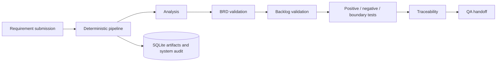

# Architecture

The MVP is a local modular monolith. FastAPI serves the API and static review UI; SQLite persists projects, raw requirements, generated JSON artifacts, and append-only automated audit events.

`POST /api/projects/{projectId}/requirements` starts the pipeline automatically; `POST /workflow/run` resumes it once a requirement exists. A validation failure sets `FAILED`, records a `system` audit event with the rules version and reason, and returns a retry-safe next action. No human approval endpoints or external calls exist.
