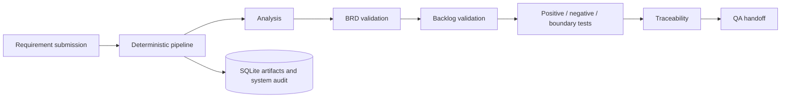

# Architecture

The MVP is a local modular monolith. FastAPI serves the API and static review UI; SQLite persists projects, requirement and artifact revisions, approvals, and append-only workflow audit events.

`POST /api/projects/{projectId}/requirements` records a requirement revision. BRD and backlog generation each stop at a mandatory approval gate; reviewer decisions retain the artifact version, timestamp, and reason. `/workflow/run` remains a compatibility/demo helper but never bypasses those gates.
