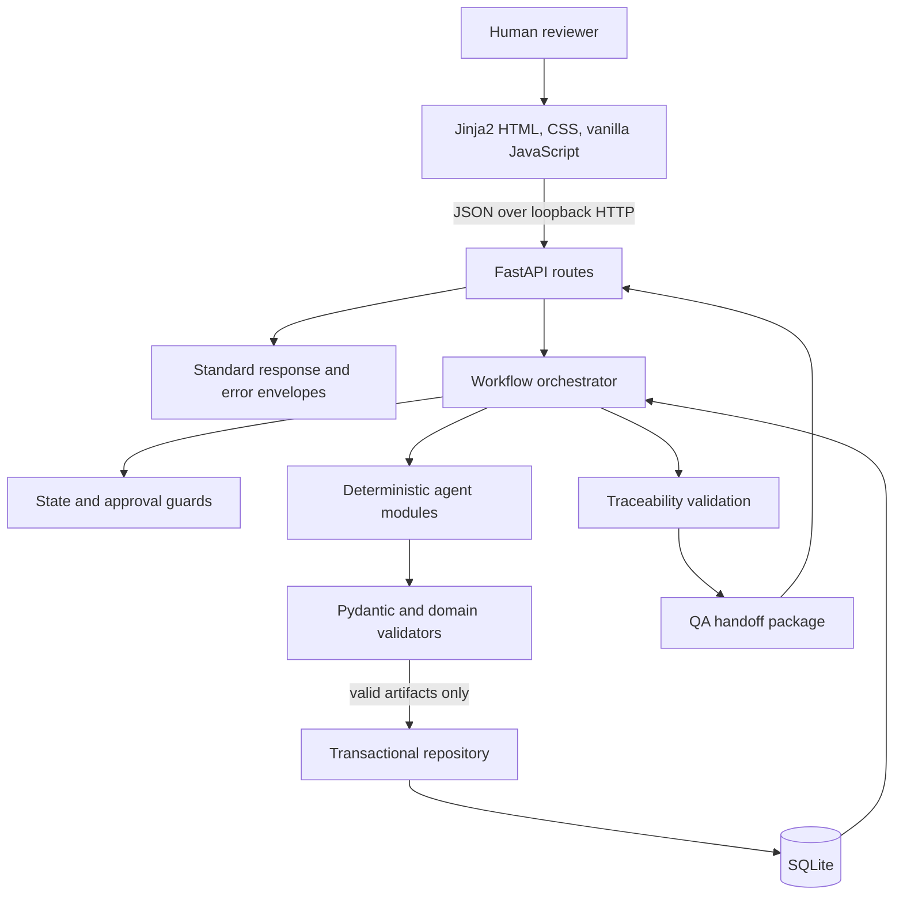
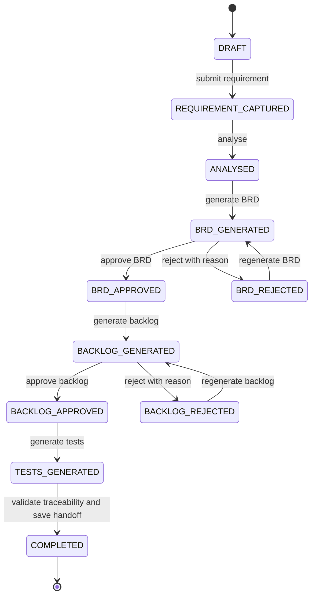
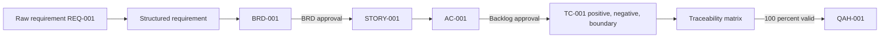

# Architecture

## Component overview

The application runs as one local Python process bound to `127.0.0.1`. FastAPI
serves both the API and the Jinja2/vanilla-JavaScript review console. A workflow
orchestrator enforces state transitions and human gates, deterministic agents
produce artifact drafts, validators reject incomplete or untraceable output,
and a transactional repository persists approved lineage in SQLite.

| Component | Responsibility |
|---|---|
| Frontend | Requirement intake, artifact review, approvals, graph, traceability, and QA handoff |
| API routes | HTTP contracts and standard success/error envelopes |
| Workflow orchestrator | Permitted transitions, approval barriers, and agent sequencing |
| Deterministic agents | Conservative artifact transformation without external calls |
| Validators | Pre-persistence structure, linkage, and coverage checks |
| Repository | SQLite transactions, revisions, stable IDs, decisions, and audit events |
| Models | Pydantic input, artifact, response, and workflow contracts |

## Mermaid architecture diagram



There is no frontend build, cloud resource, task queue, model API, or external
service in the executable MVP.

## Agent responsibilities

The product UI presents the official eleven-role target network. Capability
labels distinguish executable MVP behavior from roadmap-only roles.

| # | Agent | Responsibility | MVP status |
|---:|---|---|---|
| 01 | Requirement Intake Agent | Normalize, validate, and structure incoming requirements | Active |
| 02 | Knowledge Retrieval Agent | Retrieve authorized prior work, standards, and decisions | Planned; no source configured |
| 03 | BRD Generation Agent | Generate a traceable BRD with scope, assumptions, and risks | Active |
| 04 | Backlog Decomposition Agent | Convert an approved BRD into stories and acceptance criteria | Active |
| 05 | Sprint Planning Agent | Recommend scope, sequencing, dependencies, and risks | Planned |
| 06 | Solution & Code Generation Agent | Design and implement approved stories in a sandbox | Planned; outside MVP |
| 07 | Git Operations Agent | Manage authorized branches, commits, and pull requests | Planned; outside MVP |
| 08 | Code Review Agent | Review changes against requirements and policy | Planned |
| 09 | Sanity Testing Agent | Design tests and eventually run fast validation | Partial; test design only |
| 10 | QA Handoff Agent | Package approvals, tests, assumptions, risks, and coverage | Active |
| 11 | Knowledge Graph Agent | Persist validated lineage, decisions, and outcomes as a graph | Planned; SQLite lineage only |

Executable supporting modules are the Requirement Analyst, BRD, Backlog, QA
Test, Traceability, and QA Handoff agents. Workflow orchestration,
traceability validation, and approval/audit handling are supporting controls,
not extra product-facing agents.

## Workflow and state diagram



An action outside its permitted state returns HTTP `409` with
`INVALID_STATE_TRANSITION`, the current state, and allowed actions. Rejected
artifacts retain stable public IDs and receive incremented revisions after
regeneration.

## Data flow



Every generated artifact is validated before its repository call. Repository
operations use explicit SQLite transactions; validation or persistence failure
prevents downstream state changes.

## Approval gates

### Gate 1: BRD

- Entry state: `BRD_GENERATED`
- Decisions: approve or reject
- Rejection requirement: actor, role, and non-empty reason
- Approval effect: permits backlog generation
- Audit evidence: decision ID, gate, revision, actor, role, reason/comment, and
  timestamp

### Gate 2: Backlog

- Entry state: `BACKLOG_GENERATED`
- Decisions: approve or reject
- Rejection requirement: actor, role, and non-empty reason
- Approval effect: permits test generation
- Audit evidence: same append-only decision contract as Gate 1

Neither the UI nor direct API calls can bypass these server-side guards.

## Traceability design

The complete lineage is:

```text
PRJ-001
  -> REQ-001
  -> BRD-001
  -> STORY-001
  -> AC-001
  -> TC-001 / TC-002 / TC-003
  -> QAH-001
```

- Functional requirements use derived IDs such as `REQ-001-FR-01`.
- Project IDs are global; artifact IDs are stable and project-scoped.
- `test_case_criteria` stores the many-to-many AC-to-test relationship.
- Every acceptance criterion must have positive, negative, and boundary tests.
- The Traceability Agent flags orphan requirements and untested criteria.
- QA handoff persistence requires a valid traceability report.
- Revisions identify regenerated content without changing the public ID.

## Persistence model

SQLite tables:

- `projects`
- `requirements`
- `brds`
- `stories`
- `acceptance_criteria`
- `test_cases`
- `test_case_criteria`
- `approvals`
- `qa_handoffs`
- `audit_events`
- `id_sequences`

Duplicate requirements use a normalized SHA-256 content hash scoped to the
project. Approval decisions and audit events are append-only by application
behavior.

## Key architecture decisions

| Decision | Reason | Trade-off |
|---|---|---|
| Local modular monolith | Lowest hackathon operational risk | Not independently scalable |
| Deterministic rules instead of an unavailable LLM | Honest, offline, repeatable execution | Less flexible interpretation |
| FastAPI plus Jinja2 and vanilla JavaScript | One process and no frontend build | UI logic is not component-framework based |
| SQLite repository | Zero-service transactional persistence | Single-user and limited concurrency |
| Server-side state guards | Approvals cannot be bypassed through UI manipulation | Workflow changes require orchestrator updates |
| Validate before persistence | Invalid generated content cannot advance state | Adds explicit validation code |
| Stable IDs plus revisions | Preserves review and test lineage | One current revision is presented by the MVP |
| Eleven-role roadmap visualization | Represents the official vision honestly | Six roles remain non-executable |

## Known architecture limitations

- One active requirement per project
- Synchronous single-user execution
- No authentication, RBAC, CSRF protection, or rate limiting
- No manual artifact editor
- No global idempotency keys beyond duplicate requirement detection
- SQLite is unencrypted, and audit events are not tamper-proof
- No runtime LLM, external knowledge source, Git/Jira integration, CI/CD,
  deployment, automated sanity execution, or enterprise knowledge graph
